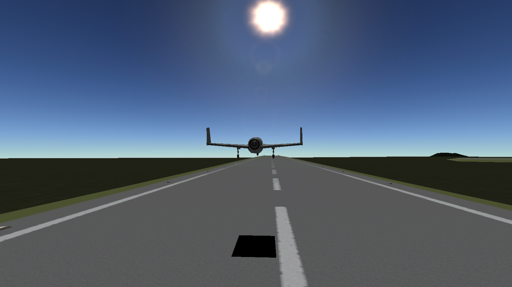

# KSPDropShadow
Is your computer too much of a potato to render real shadows?

Do you still want that nice visual cue for landing?

Then KSPDropShadow might be for you!

It adds a simple, easy-to-render shadow directly underneath your craft:



# Building
## On Linux:
```
$ git clone https://github.com/StrandedSoftwareDeveloper/KSPDropShadow.git
```
Then copy the following files from the "Kerbal Space Program/KSP_Data/Managed/" folder into the references/ folder:
```
Assembly-CSharp.dll
UnityEngine.CoreModule.dll
UnityEngine.dll
UnityEngine.PhysicsModule.dll
```
Then run:
```
$ msbuild
```

## On Windows:
I'm not really sure, I haven't really used windows in a few years.
Open an issue if you need help building this on windows.

## On MacOS:
I really have no clue.
You can open an isssue to ask for help, but I don't know how much I'd be able to give.
